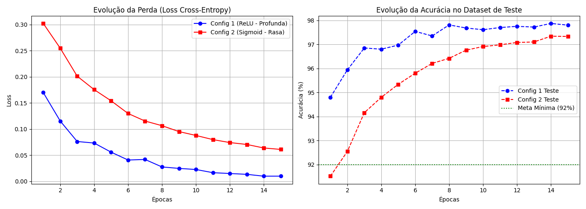
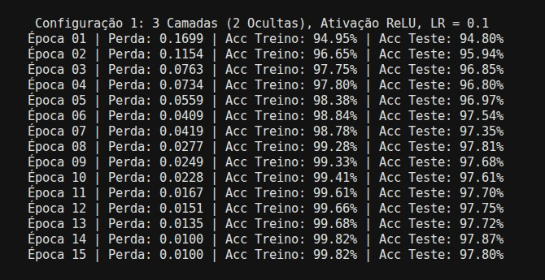
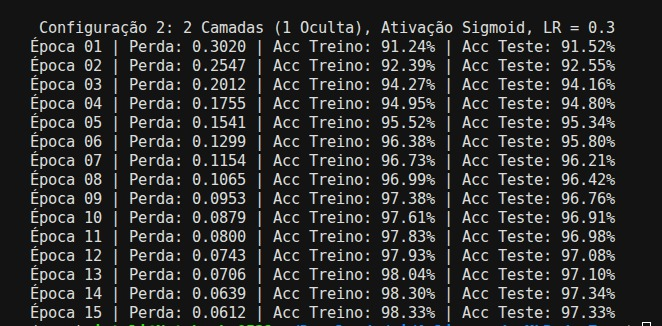

# Aplicação de MLP 

## Contexto 

A atividade demanda treinar um MLP para classificar os 10 dígitos manuscritos do dataset MNIST sem usar PyTorch, TensorFlow ou qualquer framework de deep learning. A única biblioteca permitida para os cálculos matriciais é o NumPy.

## Fluxo de Desenvolvimento 

Antes de qualquer coisa, comecei seguindo o conselho do professor e codei do zero uma rede neural para o problema XOR. Embora desafiador, pois não usei nenhuma inteligência artificial para ajuda, essa etapa foi imprescindível para que eu conseguisse consolidar, de fato, as aulas e os autoestudos, assim como evoluir meu raciocínio matemático e entender profundamente com clareza a lógica do MLP. Para isso, usei a função de ativação sigmoid. 
Após essa etapa, utilizei da mesma estrutura forward e backward para contemplar a problemática do escopo da atividade para classificar os 10 dígitos manuscritos do dataset MNIST. Nessa etapa, fiz um código bem simples, com o fito de testar meus conhecimentos e alavancar meu aprendizado com a função de ativação ReLu. Por fim, implementei mais camadas e a comparação entre configurações de rede me levou a dar um passo maior de modularizar o código, o que expandiu minha lógica de estrutura de código para redes neurais. Paralelamente "brinquei" com os parâmetros de matemática, gradiente, learning_rate...
Todo esse processo foi feito com o fito máximo de aprendizado e, enquanto codava e estudava no Google Colab, fui descrevendo meus insights com detalhes e "ao vivo" e coloquei tudo isso no arquivo estudos.ipynb, dentro da pasta notebooks (meus commits refletem o tempo médio demandado em cada etapa). Além disso, para maior detalhes e comprovação do meu desenvolvimento ao longo da ponderada, é válido analisar os comentários dos códigos, os quais escrevi na maioria das vezes em primeira pessoa, refletindo o que de fato eu estava raciocinando.  

## Como Rodar

**Dependências:**
- python 3.12.3
- numpy;
- matplotlib;
- tensorflow.

1) Para instalar as dependências supracitadas, rodar:
``pip install -r requirements.txt``

2) Para rodar a rede no terminal, rode:
``python main.py``

*Obs: também é possível rodar a aplicação no notebook no arquivo experimentos.py*

## Arquitetura Escolhida

Ao invés de criar uma classe única e engessada, a arquitetura foi inspirada em frameworks modernos (como o sub-módulo torch.nn do PyTorch). Essa foi uma demanda que senti ao implementar uma nova configuração de rede neural (mudando a função de ativação, o learning_rate e quantidade de camadas). Isso porque, no código passado, todas as operações matemáticas de todas as camadas estavam concentradas dentro de uma mesma classe MLP, de modo que, se houvesse a demanda de adicionar mais uma camada, seria necessário criar variáveis como as de pesos e vieses manualmente. Nessa perpectiva, modularizando o código, fiz com que cada etapa do MLP se tornasse uma classe independente com seus próprios métodos forward e backward.

Diante disso, o fluxo dinâmico dos dados configura-se em:

- **Forward Pass:** os dados de entrada entram na rede e cada camada processa o sinal e o passa para a camada seguinte. A última camada gera probabilidades e calcula o erro (loss).

- **Backward Pass:** o erro viaja no sentido oposto do supracitado. Cada camada recebe o impacto do erro da camada seguinte, calcula suas derivadas locais e repassa o sinal ajustado para a camada anterior.

Diante disso, decidi aproveitar a arquitetura para comparar duas configurações distintas de MLP, da seguinte forma:

**Configuração 1:**

- Quantidade de camadas: 3 (2 ocultas e 1 de saída);
- Função de Ativação; ReLu
- Learning_rate: 0.1.

**Configuração 2:**
- Quantidade de camadas: 2 (1 oculta e 1 de saída)
- Função de Ativação: Sigmoid
- Learning_rate: 0.2. 

Os resultados de cada uma delas pode ser conferidos na seção logo abaixo. 

## Resultados

Tendo em vista as configurações de comparação, por intermédio da análise das curvas de aprendizado abaixo, infere-se que a primeira configuração performou melhor, tanto no que tange à evolução da parte, quanto na evolução da acurácia.

Figura 1: Curvas de Aprendizado

Conforme meus estudos, além do fato da configuração 1 possuir uma camada oculta a mais, inferi que a pior performance da configuração 2 ocorre em razão da Função de Ativação Sigmoide, haja vista que ela apresenta uma problemática de sumir com o gradiente quando há muitas camadas, já que a derivada máxima da sigmóide é apenas 0.25 e, à medida que a rede tenta aprender, multiplicar repetidamente números menores que 0.25 faz com que o gradiente desapareça rapidamente antes de chegar nas primeiras camadas. Nessa esfera, ao comparar com a ReLu, temos que, para qualquer entrada positiva, a derivada sempre será 1, ou seja, o gradiente passa de forma integral pelas camadas. Paralelamente, vale mencionar que os pesos da Configuração 1 foram inicializados considerando a variância correta para a ReLU (He Initialization / Kaiming), o que também pode ter influenciado na melhor performance.

Sobre a acurácia da rede, consoante visto na evolução pela curva supracitada, a métrica foi medida a cada época, tanto para a condição de treino, quanto para a condição de teste, assim como a perda (loss). A extração dessas métricas a cada época pode ser vista ao rodar o código, conforme print abaixo:

Figura 2: Acurária de Treino, Teste e Perda em Cada Época da Configuração 1 

--

Figura 3: Acurária de Treino, Teste e Perda em Cada Época da Configuração 2

Diante isso, ao calcular a acurácia média de cada configuração, temos:

- **Configuração 1:** 98.617333…
- **Configuração 2:** 96.259333…

## Decisões e Dificuldades

Seguem abaixo, em formato de seções, as principais decisões e desafios, tanto de matemática quanto de código, que encontrei ao longo do desenvolvimento.

### He/Kaiming Initialization
Multipliquei a inicialização gaussiana por $\sqrt{2.0 / \text{input\_dim}}$ com base nos estudos que fiz, nos quais inferi que se os pesos começarem muito grandes, os sinais explodem e, se começarem muito pequenos, os neurônios morrem. Assim, essa inicialização garante que a variância das saídas de cada neurônio seja igual a 1, ideal para redes que usam ativação ReLU.

### Cache Interno (self.X)
Durante o forward, a camada obrigatoriamente armazena uma cópia da matriz de entrada X. Isso é necessário porque a derivada parcial da perda em relação aos pesos depende de $X$:$$\frac{\partial L}{\partial W} = \frac{1}{m} (dZ \cdot X^T)$$

### SoftmaxCrossEntropy

Individualmente, a derivada do Softmax é uma matriz Jacobiana complexa e pesada. No entanto, quando fundidas algebraicamente com a função de perda, as derivadas intermediárias se cancelam. Desse modo, forma-se a simplificação:
$$\frac{\partial L}{\partial Z} = A - Y$$

Implementei isso no código assim: ``return self.A - self.Y_one_hot``

Aqui, vale mencionar como dificuldade que, haja vista que a fórmula da entropia cruzada faz o cálculo de log ŷ, no caso da rede atribuir certeza de 0% para um número, temos que o cálculo de log(0) tende ao infinito negativo ($-\infty$). Sob essa perspectiva, para evitar que a perda virasse NaN, apliquei np.clip(self.A, 1e-15, 1.0). 

### Gradient_Check

Durante o desenvolvimento, senti dificuldade em garantir que a matemática que estava implementando no backward estava certa, haja vista que conforme estudei, uma simples troca de sinal pode prefudicar completamente o caminho da rede. Por isso, conforme conselho do professor, adicionei o gradient check.
Em contrapartida, ao implementar o gradient check, me deparei com o obstáculo do custo operacional, já que, para checar uma matriz de pesos de tamanho 128 por 784, a rede precisa fazer 128 x 784 x 2 (200.704) forward para recalcular a perda global para cada perturbação de e. Diante disso, tomei a decisão de criar uma lógica com apenas duas amostras de dados apenas para demonstração. 
Paralelamente, ao longo do desenvolvimento de testes, encontrei a dificuldade do underflow (quando o computador perde a precisão decimal) nos casos em que e foi bem pequeno por conta do expoente.

### Dimensões do NumPy 

No formato dos dados (features, exemplos), o viés b tem tamanho hidden_size igual a 1. Assim, quando o somei com a matriz de pontos, o NumPy repetiu o vetor horizontalmente para todos os exemplos. Para mitigar isso recuperando o gradiente de b, no backward, precisei somar as linhas horizontalmente e forçar o retorno da dimensão original usando keepdims=True. Dessa forma, evitei que o NumPy "achatasse" a matriz em um vetor unidimensional simples, e, consequentemente, quebrasse os cálculos futuros.

## Declaração de udo de IA
Durante o desenvolvimento, utilizei inteligência artificial para configurar o ambiente virtual, pois estava obtendo muitos problemas com instalação das bibliotecas em amientes errados e, haja vista que sou usuária de Linux, os testes não rodavam. Também usei inteligência artificial para formatar cálculos matemáticos em markdown nesta documentação. 